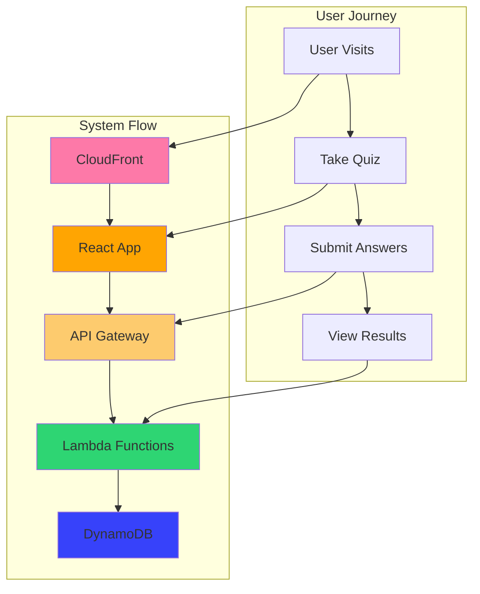

# AWS Mock Test Platform - Project Architecture & Decisions

## 🎯 Project Vision
A cloud-native, serverless mock test platform for AWS Solutions Architect Associate certification. Combines modern React frontend with AWS serverless backend for scalable, cost-effective quiz experiences.

## 🏗️ Architecture Decision Records (ADRs)

### **ADR-001: Cloud-Native Serverless Architecture**
**Decision**: Use AWS Lambda + DynamoDB instead of traditional backend
**Rationale**: 
- Zero server management overhead
- Pay-per-use cost model
- Auto-scaling capabilities
- AWS-native integration

### **ADR-002: Single Table DynamoDB Design**
**Decision**: Use single DynamoDB table with composite keys
**Rationale**:
- Cost optimization (single table vs multiple tables)
- Efficient query patterns with GSI
- Simplified data relationships

### **ADR-003: Infrastructure as Code**
**Decision**: Use CloudFormation for all AWS resources
**Rationale**:
- Version control for infrastructure
- Repeatable deployments
- Environment consistency
- Disaster recovery capabilities

### **ADR-004: PDF Processing Pipeline**
**Decision**: Python-based PDF extraction with regex parsing
**Rationale**:
- pypdf library reliability
- Flexible text processing with regex
- Easy integration with AWS Lambda
- Structured data output for DynamoDB

## 🔄 Migration Workflow

### **Phase 1: Foundation (Current)**


### **Phase 2: Cloud Migration (Next)**


**Serverless Deployment Strategy:**
- **Infrastructure First**: CloudFormation creates all AWS resources
- **Code Deployment**: Lambda functions deployed to created infrastructure
- **Data Population**: Migration scripts populate DynamoDB
- **Integration Testing**: End-to-end validation of complete system

### **Phase 3: Production (Future)**


## 📊 Data Architecture

### **Question Data Structure**
```json
{
  "PK": "QUESTION#<uuid>",           // Partition Key
  "SK": "Q#<number>",                // Sort Key  
  "id": "<uuid>",                    // Unique identifier
  "question_number": "1",            // Question sequence
  "question_text": "...",            // Question content
  "options": [...],                  // Answer choices
  "correct_count": 1,                // Number of correct answers
  "source_page": 1,                  // PDF page reference
  "exam_type": "AWS-SAA-C03"         // Certification type
}
```

### **DynamoDB Access Patterns**
1. **Get Question by ID**: `PK = QUESTION#<uuid>`
2. **List Questions by Number**: `SK begins_with Q#`
3. **Query by Exam Type**: GSI on `exam_type`
4. **Pagination Support**: Built-in with DynamoDB

## 🏗️ SOLID Principles Implementation

### **Single Responsibility Principle (SRP)**
- **Frontend Components**: Each component handles one responsibility (QuestionCard displays questions, Navigation handles progress)
- **Backend Services**: PDF extraction, question parsing, and data formatting are separated
- **Context Providers**: QuestionContext manages question state, ColorSchemeContext manages theming

### **Open/Closed Principle (OCP)**
- **Theme System**: New color schemes can be added without modifying existing components
- **Question Sources**: Easy to extend to support different question sources (API, database, files)
- **Component Architecture**: Components are open for extension but closed for modification

### **Liskov Substitution Principle (LSP)**
- **Data Sources**: Question sources can be swapped without affecting frontend
- **Theme Implementation**: All theme implementations follow the same interface
- **Processing Pipeline**: Different PDF parsers can be substituted

### **Interface Segregation Principle (ISP)**
- **Component Props**: Components only receive props they actually use
- **API Endpoints**: Specific endpoints for specific operations
- **Context APIs**: Separate contexts for different concerns (questions vs theming)

### **Dependency Inversion Principle (DIP)**
- **Frontend-Backend Decoupling**: Frontend depends on abstractions (interfaces) not concrete implementations
- **Service Layer**: Business logic depends on abstractions, not concrete data sources
- **Cloud Services**: Application depends on AWS service interfaces, not specific implementations

## 🔧 Development Workflow

### **Local Development**
1. **PDF Processing**: Extract questions using Python parser
2. **Data Validation**: Verify question structure and completeness
3. **Frontend Testing**: Use local JSON data for development
4. **Integration Testing**: Mock API responses for end-to-end testing

### **Cloud Deployment**
1. **Infrastructure**: Deploy CloudFormation stack
2. **Data Migration**: Upload questions to DynamoDB
3. **API Deployment**: Deploy Lambda functions
4. **Frontend Build**: Build and deploy React app to S3/CloudFront
5. **Integration Testing**: End-to-end testing in cloud environment

## 🐛 Troubleshooting

### **Common Issues**
- **PDF Extraction Errors**: Check if PDFs are encrypted or corrupted
- **Frontend Build Issues**: Clear node_modules and reinstall dependencies
- **Theme Switching**: Verify localStorage permissions in browser
- **API Integration**: Ensure CORS is properly configured

### **Development Tips**
- Use `uv sync` to manage Python dependencies
- Run `npm run lint` before committing changes
- Test PDF extraction with different PDF formats
- Verify question structure after parsing

## 🎯 Success Metrics

### **Technical Metrics**
- API Response Time: < 200ms
- Frontend Load Time: < 2s
- Database Query Performance: < 50ms
- Uptime: > 99.9%

### **User Experience Metrics**
- Quiz Completion Rate: Target > 80%
- User Engagement: Time spent per question
- Performance Accuracy: Score distribution analysis
- Mobile Usage: Responsive design effectiveness

## 🔐 Security Considerations

### **Data Protection**
- HTTPS-only communication
- CORS configuration for domain restrictions
- Input validation and sanitization
- No sensitive data in client-side code

### **Access Control**
- IAM roles with least privilege
- API rate limiting
- Optional user authentication (Cognito)
- CloudTrail logging for audit

## 🚀 Deployment Environments

| Environment | Purpose | Infrastructure |
|-------------|---------|----------------|
| **Development** | Local testing | Local JSON + React dev server |
| **Staging** | Pre-production testing | AWS stack with test data |
| **Production** | Live platform | AWS stack with full question bank |

## 📈 Scaling Strategy

### **Horizontal Scaling**
- Lambda auto-scaling based on requests
- DynamoDB on-demand scaling
- CloudFront global edge locations
- API Gateway automatic load balancing

### **Performance Optimization**
- DynamoDB query optimization
- Lambda cold start mitigation
- Frontend code splitting
- Image and asset optimization

---

*Last Updated: January 9, 2025*
*Architecture: Cloud-Native Serverless*
*Status: Phase 1 Complete - PDF Processing & Data Extraction*