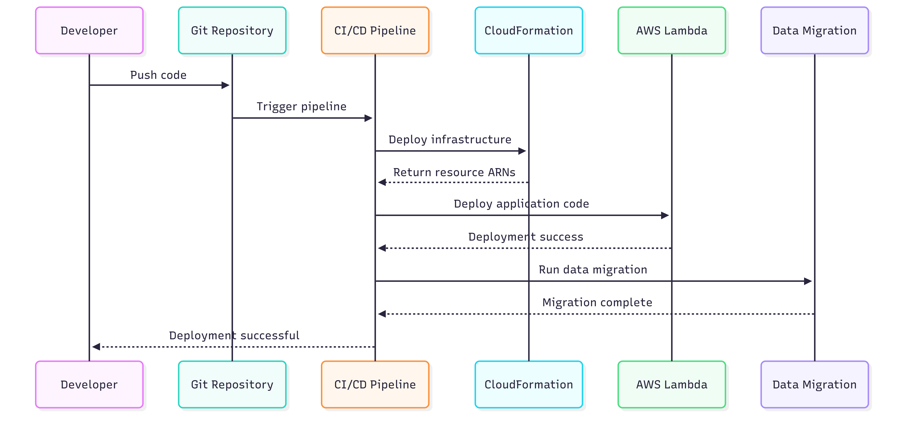

# AWS Solutions Architect Associate Mock Test Platform

A modern, cloud-native mock test platform for AWS Solutions Architect Associate (SAA-C03) certification preparation. Features a React frontend with serverless AWS backend for scalable, real-time quiz experiences.

## 🏗️ Architecture Overview

```
┌─────────────────┐    ┌─────────────────┐    ┌─────────────────┐
│   Frontend      │    │  Serverless     │    │   Data Layer    │
│   (React SPA)   │◄──►│  (AWS Lambda)   │◄──►│   (DynamoDB)    │
└─────────────────┘    └─────────────────┘    └─────────────────┘
         │                       │                       │
    ┌────▼────┐             ┌────▼────┐             ┌────▼────┐
    │S3+CDN   │             │API GW   │             │S3 Assets│
    │Hosting  │             │REST API │             │PDF Store│
    └─────────┘             └─────────┘             └─────────┘
```

## 🚀 Project Structure

```
aws-mock-test/
├── aws-mock-fe/              # React Frontend Application
│   ├── src/components/       # UI Components
│   ├── src/contexts/         # State management
│   └── src/data/            # Local development data
├── aws-mock-serverless/      # Cloud-Native Serverless Services
│   ├── main.py              # PDF processing & data extraction
│   ├── lambda/              # AWS Lambda functions (planned)
│   ├── resources/           # Source PDF files
│   └── infrastructure/      # CloudFormation templates (planned)
└── docs/                    # Project documentation
```

## 🎯 Key Features

### **Frontend (React SPA)**
- 🎨 **Clean UI**: Modern design with Tailwind CSS
- 🌈 **Theme System**: Color scheme management with React Context
- 📱 **Responsive**: Mobile-friendly layout
- 💾 **State Management**: React Context for questions and themes
- 🔄 **Interactive**: Question navigation and answer tracking

### **Serverless Backend (AWS)**
- ⚡ **PDF Processing**: Automated question extraction from PDFs
- 🗃️ **Data Storage**: DynamoDB with optimized query patterns
- 🔗 **REST API**: Lambda functions with API Gateway
- 📊 **Scalable**: Auto-scaling based on demand
- 🛡️ **Secure**: IAM roles and CORS configuration

## 🛠️ Technology Stack

| Layer | Technology | Purpose |
|-------|------------|---------|
| **Frontend** | React 19.1.1, Vite, Tailwind CSS | Modern SPA with advanced UI |
| **API** | AWS API Gateway, Lambda | Serverless REST endpoints |
| **Database** | AWS DynamoDB | NoSQL document storage |
| **Storage** | AWS S3 | PDF files and static assets |
| **Processing** | Python 3.12+, pypdf | Question extraction pipeline |
| **Infrastructure** | AWS CloudFormation | Infrastructure as Code |
| **Deployment** | AWS CDN (CloudFront) | Global content delivery |

## 📈 Data Flow

```
PDF Files → Python Parser → DynamoDB → Lambda API → React Frontend
    ↓            ↓             ↓           ↓            ↓
S3 Storage → JSON Export → Question DB → REST API → User Interface
```

## 🚀 Getting Started

### **Prerequisites**
- Node.js 18+ and npm
- Python 3.12+
- uv package manager
- AWS CLI (for cloud deployment)

### **Development Setup**
```bash
# Clone and setup
git clone <repo-url>
cd aws-mock-test

# Frontend setup
cd aws-mock-fe
npm install
npm run dev

# Serverless setup  
cd ../aws-mock-serverless
uv sync
uv run python main.py
```

### **Cloud Deployment**
```bash
# Deploy infrastructure
aws cloudformation deploy --template-file infrastructure/template.yaml

# Upload questions to DynamoDB
aws dynamodb batch-write-item --request-items file://questions_dynamodb_format.json

# Deploy Lambda functions
aws lambda update-function-code --function-name GetQuestions
```

## 🎓 Exam Coverage

- **Question Types**: Multiple choice, single answer
- **Topics**: AWS Solutions Architecture patterns
- **Source**: Official AWS SAA-C03 sample questions
- **Format**: Structured JSON with unique IDs for tracking

## 🔮 Roadmap

- [x] **Phase 1**: PDF processing and data extraction ✅
- [x] **Phase 1.5**: Serverless architecture design ✅  
- [ ] **Phase 2**: CloudFormation infrastructure setup
- [ ] **Phase 3**: Lambda API development
- [ ] **Phase 4**: Frontend-cloud integration
- [ ] **Phase 5**: User authentication & progress tracking
- [ ] **Phase 6**: Advanced features (timers, explanations, analytics)

### **Current Status: Phase 1.5 Complete**
✅ PDF question extraction working  
✅ Industry-standard serverless structure implemented  
✅ SOLID principles applied throughout  
✅ DynamoDB-ready data format generated  
✅ Comprehensive documentation created  



## 🏗️ SOLID Principles in Action

### **Single Responsibility**
- **Components**: Each UI component has one clear purpose
- **Services**: PDF processing, question parsing, and API handling are separate
- **Data Layer**: Clear separation between data access and business logic

### **Open/Closed**
- **Theme System**: Add new themes without modifying existing code
- **Question Sources**: Easily swap between local JSON, API, and database
- **Component Architecture**: Extend functionality through composition

### **Liskov Substitution**
- **Data Sources**: Question providers can be interchanged
- **Theme Implementations**: All themes follow the same interface
- **Processing Pipeline**: Different parsers can be swapped

### **Interface Segregation**
- **Component Props**: Minimal props for each component
- **API Contracts**: Specific endpoints for specific needs
- **Context Separation**: Different contexts for different concerns

### **Dependency Inversion**
- **Frontend-Backend**: Frontend depends on abstractions, not implementations
- **Service Layer**: Business logic depends on interfaces
- **Cloud Services**: Application depends on service abstractions

## 📚 Documentation

- [`aws-mock-fe/CLAUDE.md`](aws-mock-fe/CLAUDE.md) - Frontend implementation details
- [`aws-mock-serverless/CLAUDE.md`](aws-mock-serverless/CLAUDE.md) - Serverless architecture details
- [`CLAUDE.md`](CLAUDE.md) - Overall project tracking and architecture decisions

## 🔧 Troubleshooting

### **Common Issues**
- **PDF Processing**: Ensure PDFs are not encrypted or password-protected
- **Frontend Build**: Clear `node_modules` and run `npm install` if issues occur
- **Theme Persistence**: Check browser localStorage permissions
- **Python Dependencies**: Use `uv sync` to ensure proper dependency management

### **Development Tips**
- Run `npm run lint` before committing frontend changes
- Test PDF extraction with multiple PDF formats
- Verify question structure after parsing
- Use the development server for hot-reload during frontend development

---

**Built with ❤️ for AWS certification success**
