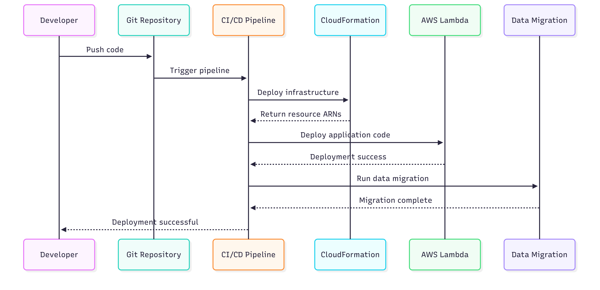

# AWS Mock Test Serverless Services

## 🎯 Service Overview
Cloud-native serverless service for processing AWS certification question PDFs and providing REST API endpoints. Built following SOLID principles with clear separation of concerns.

## 🏗️ Architecture Pattern: Layered Serverless Design

```
┌─────────────────────────────────────────────────────────────┐
│                    API Gateway (REST)                      │
├─────────────────────────────────────────────────────────────┤
│                 Lambda Handlers Layer                      │
│  ┌─────────────┐ ┌─────────────┐ ┌─────────────┐          │
│  │get_questions│ │get_question │ │submit_answer│          │
│  └─────────────┘ └─────────────┘ └─────────────┘          │
├─────────────────────────────────────────────────────────────┤
│                 Business Logic Layer                       │
│  ┌─────────────┐ ┌─────────────┐ ┌─────────────┐          │
│  │PDFService   │ │QuestionSvc  │ │ValidationSvc│          │
│  └─────────────┘ └─────────────┘ └─────────────┘          │
├─────────────────────────────────────────────────────────────┤
│                    Data Models Layer                       │
│  ┌─────────────┐ ┌─────────────┐                          │
│  │Question     │ │QuestionOpt  │                          │
│  └─────────────┘ └─────────────┘                          │
├─────────────────────────────────────────────────────────────┤
│                    Data Storage Layer                      │
│                      DynamoDB                              │
└─────────────────────────────────────────────────────────────┘
```

## 📁 Project Structure (Industry Standard)

```
aws-mock-serverless/
├── src/                    # Application source code
│   ├── handlers/           # Lambda function entry points
│   │   ├── get_questions.py    # GET /questions
│   │   ├── get_question.py     # GET /questions/{id}
│   │   └── submit_answer.py    # POST /answers (future)
│   ├── services/           # Business logic layer
│   │   ├── pdf_service.py      # PDF processing logic
│   │   ├── question_service.py # Question operations
│   │   └── validation_service.py # Data validation
│   ├── models/             # Data models and schemas
│   │   ├── question.py         # Question data model
│   │   └── response.py         # API response models
│   ├── utils/              # Shared utilities
│   │   ├── db_utils.py         # DynamoDB helpers
│   │   └── response_builder.py # API response formatting
│   └── config/             # Configuration management
│       └── settings.py         # Environment-specific settings
├── infrastructure/         # CloudFormation templates
│   ├── template.yaml           # Main infrastructure template
│   ├── parameters/            # Environment-specific parameters
│   └── outputs/               # Stack outputs for integration
├── tests/                  # Test files
│   ├── unit/                  # Unit tests
│   └── integration/           # Integration tests
├── resources/              # Static resources
│   └── *.pdf                  # Source PDF files
├── main.py                 # Local development script
├── pyproject.toml          # Python dependencies
└── requirements.txt        # Lambda layer dependencies
```

## 🎯 SOLID Principles Implementation

### **Single Responsibility Principle (SRP)**
- **PDFService**: Only handles PDF extraction and parsing
- **QuestionService**: Only manages question data operations
- **Lambda Handlers**: Only handle HTTP requests/responses
- **Models**: Only define data structure and validation

### **Open/Closed Principle (OCP)**
- **New Question Sources**: Add new parsers without modifying existing code
- **New API Endpoints**: Add new handlers without changing existing ones
- **New Data Formats**: Extend models without breaking existing functionality

### **Liskov Substitution Principle (LSP)**
- **PDF Parsers**: Different PDF libraries can be swapped
- **Database Clients**: Can substitute DynamoDB with other NoSQL databases
- **Response Formats**: Different response formatters can be used

### **Interface Segregation Principle (ISP)**
- **Handler Dependencies**: Each Lambda only imports what it needs
- **Service Interfaces**: Minimal, focused service contracts
- **Model Interfaces**: Specific data contracts for each use case

### **Dependency Inversion Principle (DIP)**
- **Services depend on abstractions**: Not concrete database implementations
- **Handlers depend on service interfaces**: Not direct database access
- **Configuration-driven**: Environment variables, not hardcoded values

## 🚀 Industry Standard: Infrastructure vs Application Separation

### **❌ What NOT to do:**
```python
# DON'T: CloudFormation loading application code
CloudFormation → Reads Python files → Creates Lambda with code
```

### **✅ Industry Standard:**
```
1. Infrastructure (CloudFormation) → Creates empty resources
2. Application Code → Deployed separately to resources  
3. Data Migration → Populates resources with data
```

### **🔄 Deployment Pipeline**



**Industry Standard Deployment Flow:**
1. **Developer** pushes code to Git Repository
2. **CI/CD Pipeline** triggers automated deployment
3. **CloudFormation** deploys infrastructure resources
4. **Application Code** deploys to Lambda functions
5. **Data Migration** populates DynamoDB with questions
6. **Integration Tests** verify end-to-end functionality

## 📊 Data Flow Architecture

### **Development Phase (Current)**
```
PDF Files → Python Parser → JSON Files → Manual Review
```

### **Production Phase (Target)**
```
PDF Files → Lambda Processor → DynamoDB → API Gateway → Frontend
```

## 🛠️ Technology Stack

| Layer | Technology | Purpose |
|-------|------------|---------|
| **API** | AWS API Gateway | REST endpoint management |
| **Compute** | AWS Lambda | Serverless function execution |
| **Database** | AWS DynamoDB | NoSQL document storage |
| **Storage** | AWS S3 | PDF file storage |
| **Infrastructure** | AWS CloudFormation | Infrastructure as Code |
| **Processing** | Python 3.12+ | PDF parsing and data processing |

## 🔧 Development Commands

```bash
# Local development
uv sync                          # Install dependencies
uv run python main.py           # Process PDFs locally

# Testing
python -m pytest tests/         # Run unit tests
python -m pytest tests/integration/  # Run integration tests

# AWS deployment (future)
aws cloudformation deploy --template-file infrastructure/template.yaml
aws lambda update-function-code --function-name GetQuestions
```

## 📈 Performance Considerations

### **Lambda Optimization**
- **Cold Start**: Minimize imports in handler functions
- **Memory**: Right-size memory allocation (128MB-3008MB)
- **Timeout**: Set appropriate timeouts (3-15 minutes max)

### **DynamoDB Optimization**
- **Query Patterns**: Design keys for efficient queries
- **Indexes**: Use GSI for different access patterns
- **Capacity**: Start with on-demand, move to provisioned for predictable loads

---

**Next Steps**: CloudFormation template creation and deployment pipeline setup